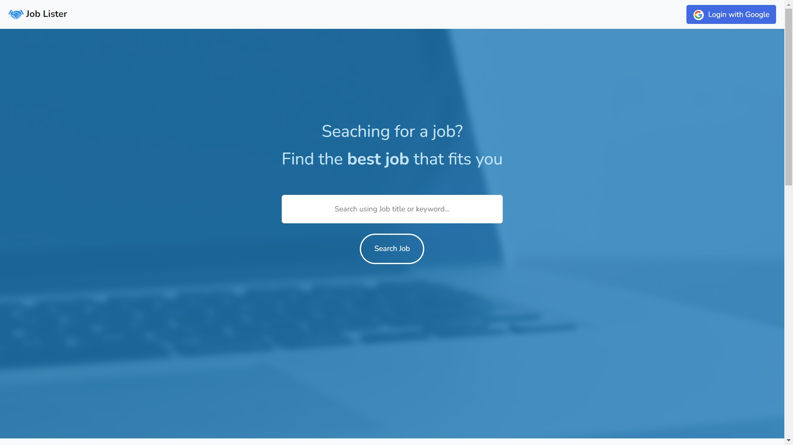
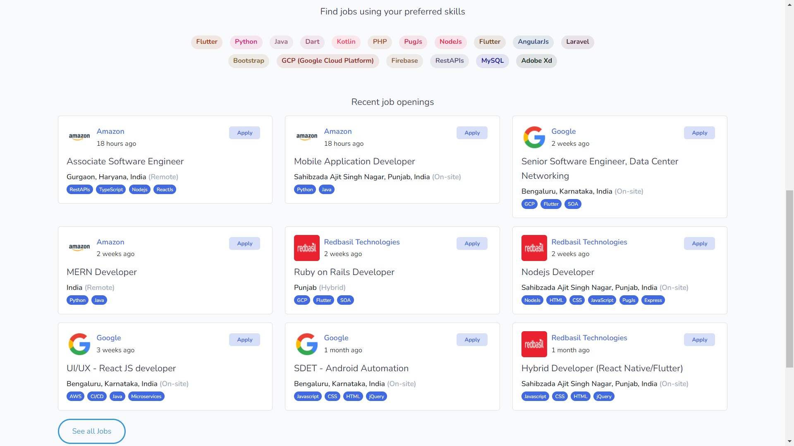
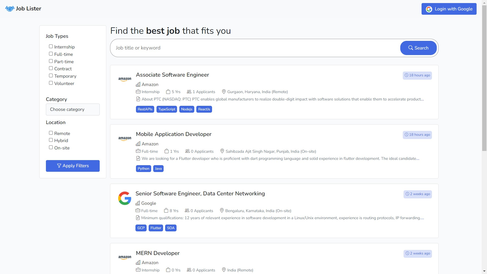
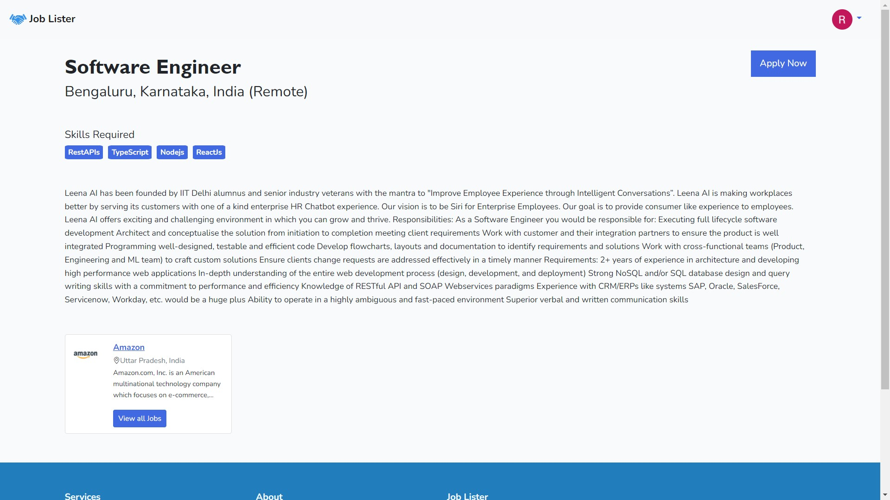
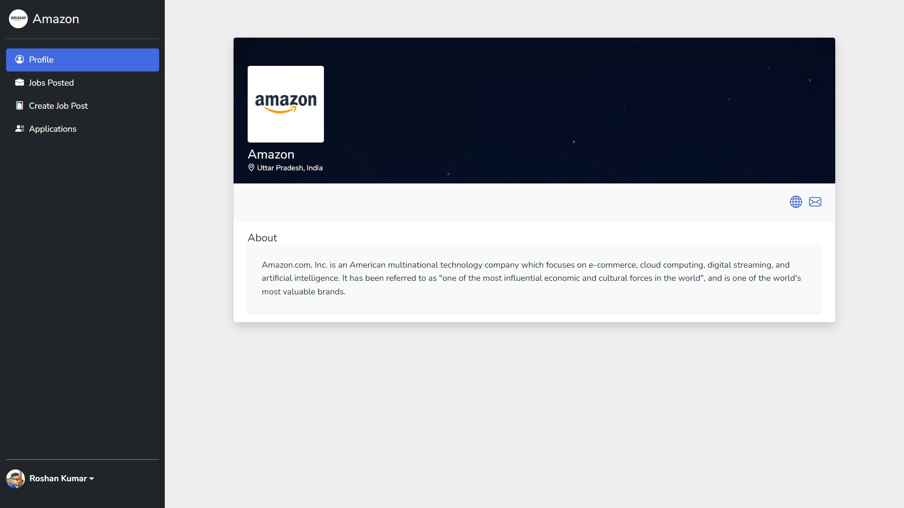
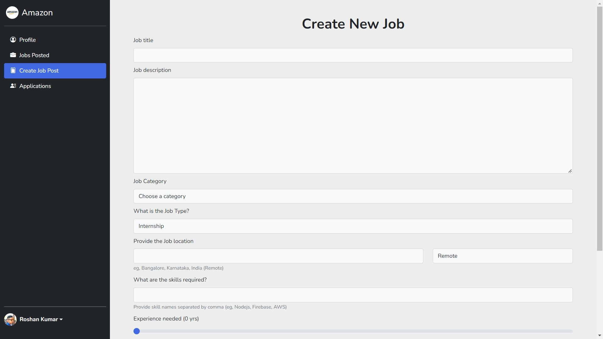
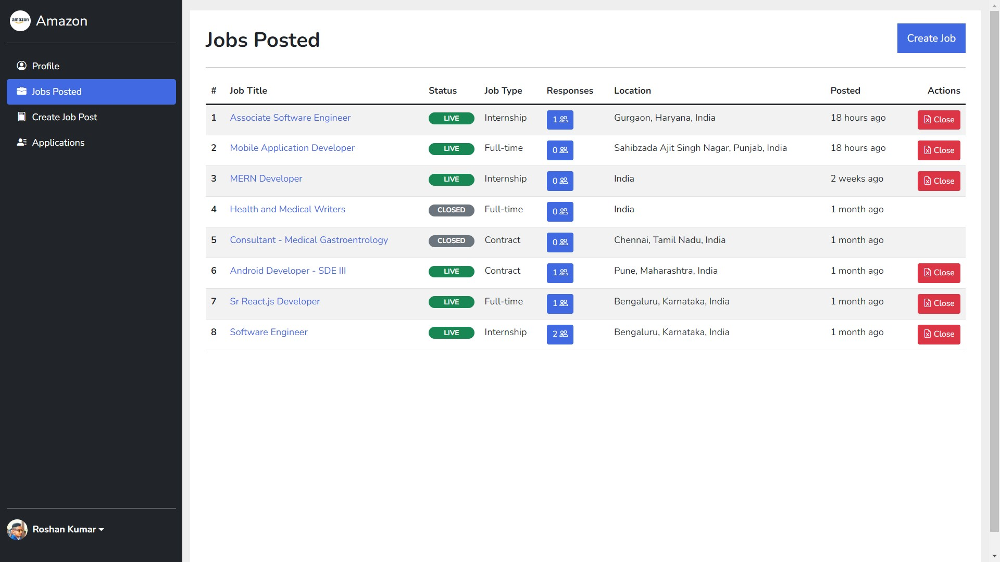
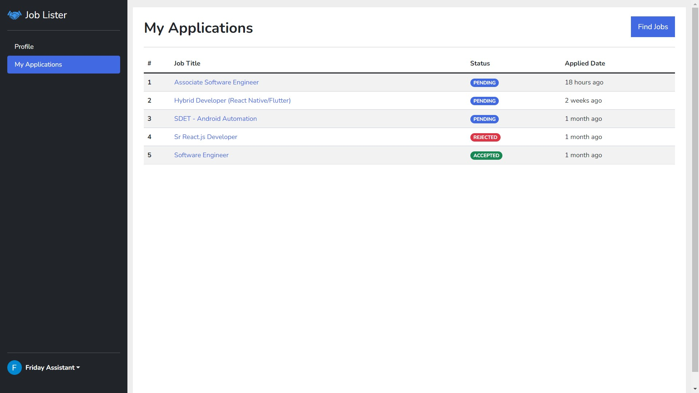
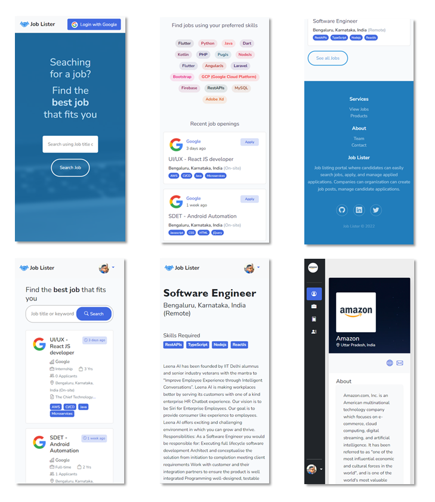

# Job Lister

[](https://github.com/roshan9419) [](https://github.com/roshan9419) [](https://github.com/roshan9419) [](https://github.com/roshan9419) [](https://github.com/roshan9419) [](https://github.com/roshan9419) [](https://github.com/roshan9419) [](https://github.com/roshan9419)

<br>

## About

Job lister is developed using Laravel framework and MySQL for database. It shows job listings which helps candidates to find their perfect jobs. Here, company can create job posts and candidates can filter and search them out and can direct apply to it.

<br>

## Some screenshots








  

<br>

## Setup Project

1. Clone or download the project
```sh
git clone https://github.com/roshan9419/job-lister.git
```

2. Install and build the dependencies in the project directory
```sh
cd job-lister
composer install
npm install
npm run dev
```

3. Create .env file from .env.example file
```sh
copy .env.example .env
```

4. Generate the key of your project
```sh
php artisan key:generate
```

5. Migrate the tables into database (Make sure you have done below Environment > Database configurations)
```sh
php artisan migrate
```

6. Run / Serve the project locally
```sh
php aritsan serve
````

## Environment

1. Database configurations
```sh
DB_DATABASE=job_lister  # database name (create or use your own)
DB_USERNAME=root        # database username (default is root)
DB_PASSWORD=123456      # database password if any
```

2. Google Client configurations for Sign In  
- Create or use existing Google project https://console.cloud.google.com/
- Goto **APIs and Service > Credentials** https://console.cloud.google.com/apis/credentials
- Click on **Create Credentials** button and choose **OAuth client ID** option
- Select *Web application* in **Application Type**
- Give the name e.g., *web-client-local*
- Click on **ADD URI** button under **Authorised JavaScript origins** section and paste the localhost url http://127.0.0.1:8000
- Click on **ADD URI** button under **Authorised redirect URIs** section and paste the redirect url http://127.0.0.1:8000/auth/google/callback (it will be used when user Sign In successfully)
- Finally create by clicking on **Save** button
- Copy the **Client ID** and **Client Secret** and update the below variables
```sh
GOOGLE_CLIENT_ID="Client ID"
GOOGLE_CLIENT_SECRET="Client Secret"
```

## Authors

**roshan9419** 🧐 

See also the list of [contributors](https://github.com/roshan9419/job-lister/graphs/contributors) who have participated in this project.

## License

This project is licensed under the MIT License - see the [LICENSE](LICENSE) file for details
